# Pareto Execution Plan — go-policy-dsl

> **Snapshot:** 2026-08-08 08:24
> **Updated:** 2026-08-08 — P1 (library-policy migration) **DONE**; P3 (branch protection) **DISAPPROVED** by user
> **Project state:** v0.3.0 public, CI green, docs healthy (Accuracy 10/10, Fitness 10/10), TODO_LIST empty
> **Input sources:** `ROADMAP.md`, `FEATURES.md`, recent `docs/status/*` reports (2026-08-08), code audit

> **Major update (2026-08-08):** `library-policy` has shipped on
> `go-policy-dsl` v0.3.0 — the first consumer gate for v1.0.0 is **MET**.
> The consumer adopted the DSL as-is with no blocking API gaps. Branch
> protection has been **disapproved** by the user (daemon workflow conflict).
> See updated tables below for revised status.

---

## 1. Context: where is the project?

The library is in excellent shape:

- **Stable API at v0.3.0** — stdlib-only, panic-free, fuzz-pinned, 55 tests, 0 lint issues
- **Docs are accurate** — just completed a full docs-health audit; every claim verified against code
- **Public on GitHub + pkg.go.dev + proxy.golang.org** — all three versions indexed
- **CI is green and fast** (37s quality gate via golangci-lint-action)
- **Zero open TODOs** — all prior work shipped across v0.1.0–v0.3.0

The v1.0.0 gate is now down to one question: **does the validation surface
need to expand?** Gate 1 (first consumer shipped) is MET — `library-policy`
is on v0.3.0. Gate 3 (no stringly-typed axes) was already met. Gate 2
(validation surface) is the remaining open question: the consumer adopted
the DSL as-is, so the current surface was sufficient, but whether
`library-policy` revealed unmet validation needs is not yet confirmed.

---

## 2. Pareto Breakdown

### The 1% that delivers 51%

| # | Task | Status |
|---|------|--------|
| **P1** | **library-policy migration** | **DONE** — shipped on v0.3.0. API proven in a real consumer. No blocking gaps surfaced. |

### The 4% that delivers 64%

| # | Task | Status |
|---|------|--------|
| **P1** | library-policy migration | **DONE** |
| **P2** | Release checklist doc | Not started — still high-value (all 3 releases had CI-red-on-tag issues) |
| **P3** | Branch protection on master | **DISAPPROVED** by user — daemon workflow conflict. Removed from plan. |
| **P4** | pkg.go.dev re-index | Stale README served (dead badge, old structure). Self-corrects on next tag push. |

### The 20% that delivers 80%

| # | Task | Status |
|---|------|--------|
| **P1** | library-policy migration | **DONE** |
| **P2** | Release checklist doc | Not started |
| **P3** | Branch protection | **DISAPPROVED** |
| **P4** | pkg.go.dev re-index | Self-corrects on next tag |
| **P5** | Release automation (GitHub Action: tag → release from CHANGELOG) | Not started — reduces friction now that consumer pins versions |
| **P6** | `govulncheck` in CI | Not started — stdlib-only today, deps-of-deps matter downstream |
| **P7** | Test coverage reporting + threshold gate | Not started |
| **P8** | Godoc `ExampleSeverityBridge` | Not started — consumer has bridged in practice; example documents the pattern |
| **P9** | SBOM generation on release | Not started |

### The other 20% (to get to 100%)

| # | Task | Category |
|---|------|----------|
| P10 | CODE_OF_CONDUCT.md | Public presence |
| P11 | actionlint in CI | CI polish |
| P12 | Go versions matrix (1.26.x) | CI polish |
| P13 | Fuzz seed corpus expansion | Code quality |
| P14 | Additional godoc examples (SuggestExplicit, Validate edge cases) | API completeness |
| P15 | Awesome-go submission | Public presence |
| P16 | Blog post / announcement | Public presence |
| P17 | Cross-link from sibling repos | Public presence |
| P18 | Matcher subpackage decision | Architecture |
| P19 | Public docs website (Astro + Starlight) | Documentation |
| P20 | LSP server | Long-term vision |
| P21 | go-linter-sdk adoption | Adoption |
| P22 | golangci-lint plugin template | Adoption |

### Decided against / explicitly deferred

| Item | Reason |
|------|--------|
| Domain validation expansion | Deferred until first consumer reveals the real required-field set |
| `Require(name)` builder | YAGNI — no consumer needs a third policy kind |
| Policy exchange format (YAML round-trip) | Contradicts "values, not YAML" premise; belongs in a consumer |
| AST-based detector reference | Behind a build tag, opt-in — only after DSL is stable |
| Severity enum pruning | No action until consumers confirm which values they use |

---

## 3. Medium-Granularity Plan (30–100 min tasks)

Sorted by impact (desc) → effort (asc) → customer value (desc).

| ID | Task | Impact | Effort | Customer Value | Est (min) | Scope | Depends on |
|----|------|--------|--------|----------------|-----------|-------|------------|
| M1 | Write release checklist doc (`docs/release-checklist.md`) | High | Low | High | 30 | This repo | — |
| M2 | Set up branch protection on master (user decision needed) | High | Low | High | 30 | GitHub settings | User input |
| M3 | Trigger pkg.go.dev re-index (`go get @latest` + request form) | Medium | Low | High | 15 | External | — |
| M4 | Create `ExampleSeverityBridge` godoc example | Medium | Low | High | 30 | This repo | — |
| M5 | Add `govulncheck` job to CI workflow | Medium | Medium | Medium | 45 | This repo | — |
| M6 | Add test coverage reporting + threshold gate to CI | Medium | Medium | Medium | 60 | This repo | — |
| M7 | Create release automation GitHub Action (tag → release) | Medium | Medium | Medium | 90 | This repo | M1 |
| M8 | Add SBOM generation to release workflow | Low | Medium | Medium | 45 | This repo | M7 |
| M9 | Add `actionlint` step to CI | Low | Low | Low | 30 | This repo | — |
| M10 | Add Go versions matrix to quality-gate job | Low | Low | Low | 30 | This repo | — |
| M11 | Add additional godoc examples (`ExampleSuggestExplicit`, `ExampleValidate_InvertedRange`) | Low | Low | Medium | 30 | This repo | — |
| M12 | Expand fuzz seed corpus with edge cases | Low | Low | Low | 45 | This repo | — |
| M13 | Create `CODE_OF_CONDUCT.md` | Low | Low | Low | 15 | This repo | — |
| M14 | Prepare library-policy migration plan (import DSL, delete local copy) | High | High | High | 60 | Other repo | — |
| M15 | Submit to awesome-go or curated lists | Low | Low | Medium | 30 | External | — |
| M16 | Write blog post / announcement for public launch | Low | Medium | Medium | 90 | External | M3 |
| M17 | Cross-link from sibling repos (go-error-family, go-output, etc.) | Low | Low | Low | 30 | Other repos | — |
| M18 | Matcher subpackage: spike + decide (in-scope or consumer-owned?) | Medium | High | Low | 90 | This repo | M14 |
| M19 | Public docs website (Astro + Starlight + Firebase) | Low | High | Low | 100+ | This repo | M14 |
| M20 | go-linter-sdk adoption spike | Low | High | Low | 60 | Other repo | M14 |
| M21 | golangci-lint plugin template repo | Low | Medium | Low | 90 | New repo | M14 |

**Total estimated effort:** ~1,055 min (~17.5 hours)

---

## 4. Fine-Granularity Plan (max 12 min each)

Sorted by impact (desc) → effort (asc) → customer value (desc).

### Tier 1: The 1% → 51%

| ID | Task | Est (min) | Depends on |
|----|------|-----------|------------|
| F1 | Draft `docs/release-checklist.md` outline (sections: pre-tag, tag, post-tag) | 10 | — |
| F2 | Write pre-tag checklist items (CI green, CHANGELOG matches `git diff`, FEATURES consistent) | 10 | F1 |
| F3 | Write tag checklist items (annotated tag, push tags, verify on remote) | 5 | F2 |
| F4 | Write post-tag checklist items (GitHub release from CHANGELOG, set Latest flag, verify pkg.go.dev) | 10 | F3 |
| F5 | Run `git status` + commit release-checklist.md | 5 | F4 |

### Tier 2: Release safety + pkg.go.dev (revised)

| ID | Task | Est (min) | Status |
|----|------|-----------|--------|
| F6-F8 | ~~Branch protection~~ | — | **DISAPPROVED** by user. Removed from plan. |
| F9-F11 | pkg.go.dev re-index | 15 | Stale README served. Self-corrects on next tag. See P4 above. |

### Tier 3: API completeness (godoc examples)

| ID | Task | Est (min) | Depends on |
|----|------|-----------|------------|
| F12 | Write `ExampleSeverityBridge` function (README bridge sample as compilable example) | 10 | — |
| F13 | Write `ExampleSuggestExplicit` function (demonstrate no-magic variant) | 10 | — |
| F14 | Write `ExampleValidate_InvertedRange` function (demonstrate error return) | 10 | — |
| F15 | Run `go test ./...` to verify examples compile | 5 | F12, F13, F14 |
| F16 | Run `golangci-lint run ./...` + `golangci-lint fmt ./...` | 5 | F15 |
| F17 | Commit example additions | 5 | F16 |

### Tier 4: CI hardening

| ID | Task | Est (min) | Depends on |
|----|------|-----------|------------|
| F18 | Add `govulncheck` job to `ci.yml` (separate job, `go run golang.org/x/vuln/cmd/govulncheck@latest ./...`) | 10 | — |
| F19 | Add test coverage step to quality-gate job (`go test -cover -coverprofile=cover.out`) | 10 | — |
| F20 | Add coverage threshold check (fail if < 90%) | 10 | F19 |
| F21 | Add `actionlint` step (install + run on `.github/workflows/`) | 10 | — |
| F22 | Add Go versions matrix (`strategy: matrix: go-version: [1.26.x, stable]`) | 10 | — |
| F23 | Verify CI YAML is valid (`go test` + `golangci-lint` locally) | 5 | F18-F22 |
| F24 | Commit CI hardening changes | 5 | F23 |

### Tier 5: Release automation

| ID | Task | Est (min) | Depends on |
|----|------|-----------|------------|
| F25 | Create `.github/workflows/release.yml` (trigger on tag push) | 10 | M1 (F5) |
| F26 | Add CHANGELOG extraction step (parse `[version]` section → release body) | 12 | F25 |
| F27 | Add SBOM generation step (`syft` or `gh` built-in) | 10 | F25 |
| F28 | Add `gh release create` step with extracted body + SBOM | 10 | F26, F27 |
| F29 | Test release workflow logic (dry-run the extraction on existing CHANGELOG) | 10 | F28 |
| F30 | Commit release automation | 5 | F29 |

### Tier 6: Public presence

| ID | Task | Est (min) | Depends on |
|----|------|-----------|------------|
| F31 | Create `CODE_OF_CONDUCT.md` (Contributor Covenant 2.1) | 10 | — |
| F32 | Commit CODE_OF_CONDUCT | 5 | F31 |
| F33 | Draft awesome-go submission text | 10 | — |
| F34 | Submit to awesome-go (PR or issue) | 10 | F33 |
| F35 | Write blog post outline (problem → solution → quick start → roadmap) | 12 | — |
| F36 | Write blog post body (expand outline) | 12 | F35 |
| F37 | Add cross-links from sibling repo READMEs | 10 | — |

### Tier 7: Consumer readiness (library-policy migration) — DONE

| ID | Task | Est (min) | Status |
|----|------|-----------|--------|
| F38-F42 | All consumer migration tasks | 58 | **DONE** — library-policy shipped on v0.3.0. API was sufficient as-is. |

### Tier 8: Architecture decisions (post-consumer)

| ID | Task | Est (min) | Depends on |
|----|------|-----------|------------|
| F43 | Spike: `matcher` subpackage — implement glob matcher, run against import paths | 12 | M14 |
| F44 | Decide: matcher in-scope or consumer-owned? (ADR) | 10 | F43 |
| F45 | Spike: godoc Example* for `CompanionWithSeverity` edge case | 10 | — |
| F46 | Expand `FuzzBuilder_PatternsOpaque` seed corpus with unicode, empty, glob chars | 10 | — |
| F47 | Expand `FuzzParseVersion` seed corpus with extreme values | 10 | — |

### Tier 9: Long-term (post-v1.0.0)

| ID | Task | Est (min) | Depends on |
|----|------|-----------|------------|
| F48 | Evaluate LSP server feasibility (gopls integration, diagnostic API) | 12 | M14 |
| F49 | Evaluate public docs website (Astro + Starlight + Firebase Hosting setup) | 12 | M14 |
| F50 | Evaluate go-linter-sdk adoption path | 12 | M14 |
| F51 | Evaluate golangci-lint plugin template (plugin API, build constraints) | 12 | M14 |

---

## 5. Execution Graph

```mermaid
graph TD
    subgraph "Tier 1: Release Safety (the 1% → 51%)"
        F1[F1: Draft release checklist outline]
        F2[F2: Pre-tag items]
        F3[F3: Tag items]
        F4[F4: Post-tag items]
        F5[F5: Commit]
        F1 --> F2 --> F3 --> F4 --> F5
    end

    subgraph "Tier 2: Repo Protection (the 4% → 64%)"
        F6[F6: Draft branch protection options]
        F7[F7: User decision]
        F8[F8: Apply via gh api]
        F9[F9: go get @latest]
        F10[F10: pkg.go.dev re-index]
        F11[F11: Verify README updated]
        F6 --> F7 --> F8
        F9 --> F10 --> F11
    end

    subgraph "Tier 3: API Completeness"
        F12[F12: ExampleSeverityBridge]
        F13[F13: ExampleSuggestExplicit]
        F14[F14: ExampleValidate_InvertedRange]
        F15[F15: go test]
        F16[F16: lint + fmt]
        F17[F17: Commit]
        F12 & F13 & F14 --> F15 --> F16 --> F17
    end

    subgraph "Tier 4: CI Hardening"
        F18[F18: govulncheck job]
        F19[F19: coverage step]
        F20[F20: threshold gate]
        F21[F21: actionlint]
        F22[F22: Go matrix]
        F23[F23: Verify CI YAML]
        F24[F24: Commit]
        F18 & F19 & F21 & F22 --> F23
        F19 --> F20 --> F23
        F23 --> F24
    end

    subgraph "Tier 5: Release Automation"
        F25[F25: release.yml workflow]
        F26[F26: CHANGELOG extraction]
        F27[F27: SBOM generation]
        F28[F28: gh release create step]
        F29[F29: Dry-run test]
        F30[F30: Commit]
        F25 --> F26 & F27
        F26 & F27 --> F28 --> F29 --> F30
    end

    subgraph "Tier 6: Public Presence"
        F31[F31: CODE_OF_CONDUCT.md]
        F32[F32: Commit]
        F33[F33: awesome-go submission text]
        F34[F34: Submit]
        F35[F35: Blog post outline]
        F36[F36: Blog post body]
        F37[F37: Cross-link siblings]
        F31 --> F32
        F33 --> F34
        F35 --> F36
    end

    subgraph "Tier 7: Consumer Migration"
        F38[F38: Read library-policy spec.go]
        F39[F39: API gap analysis]
        F40[F40: Migration plan]
        F41[F41: Test impact analysis]
        F42[F42: Breaking-change estimate]
        F38 --> F39 --> F40 --> F41 --> F42
    end

    subgraph "Tier 8-9: Architecture + Long-term"
        F43[F43: Matcher subpackage spike]
        F44[F44: Matcher ADR]
        F45-F47[F45-47: Fuzz + godoc expansion]
        F48-F51[F48-51: LSP / docs / SDK / plugin eval]
        F43 --> F44
    end

    %% Cross-tier dependencies
    F5 -.->|release checklist needed| F25
    F5 -.->|checklist gates| F26
    F42 -.->|migration unblocks| F43
    F42 -.->|migration unblocks| F48
    F42 -.->|migration unblocks| F49

    %% Styling
    classDef tier1 fill:#f9e79f,stroke:#f1c40f,stroke-width:3px
    classDef tier2 fill:#abebc6,stroke:#2ecc71,stroke-width:2px
    classDef consumer fill:#aed6f1,stroke:#3498db,stroke-width:2px
    classDef future fill:#d5dbdb,stroke:#95a5a6,stroke-width:1px

    class F1,F2,F3,F4,F5 tier1
    class F6,F7,F8,F9,F10,F11 tier2
    class F38,F39,F40,F41,F42 consumer
    class F43,F44,F48,F49,F50,F51 future
```

---

## 6. Pareto Summary Table

| Pareto Tier | Tasks | Total Est | % of Effort | % of Value | Key Deliverable |
|-------------|-------|-----------|-------------|------------|-----------------|
| **1% → 51%** | F1–F5 | 40 min | 4% | 51% | Release checklist (permanent guardrail) |
| **4% → 64%** | F6–F11 | 15 min | 1% | 3% | ~~Branch protection~~ (disapproved) + pkg.go.dev (self-corrects on next tag) |
| **20% → 80%** | F12–F30 | 194 min | 19% | 16% | Godoc examples + CI hardening + release automation |
| ~~Consumer gate~~ | ~~F38–F42~~ | ~~58 min~~ | — | — | **DONE** — library-policy shipped on v0.3.0 |
| **Other 20%** | F31–F37, F43–F51 | 170 min | 17% | 5% | Public presence + fuzz + architecture spikes |
| **Remaining** | F1–F5, F12–F30, F31–F37, F43–F51 | ~404 min | ~41% | 25% | Everything actionable from this repo |

> **Note on effort vs value:** The consumer migration (formerly the single
> highest-value item) is **DONE** — `library-policy` shipped on v0.3.0. The
> 1% tier (release checklist) is now the highest-value remaining item. The
> 20% tier (CI hardening, release automation, godoc examples) is polish that
> raises the quality bar for a library whose API is now proven.

---

## 7. What needs a user decision before execution

| Item | Status |
|------|--------|
| Branch protection | **DECIDED** — disapproved by user (2026-08-08). Daemon workflow conflict. |
| pkg.go.dev re-index | **Self-corrects on next tag.** No manual action needed unless a release is far off. |
| ~~Consumer migration~~ | **DONE** — library-policy shipped on v0.3.0. |
| v1.0.0 timing | **Open question:** gate 1 (consumer shipped) and gate 3 (no stringly-typed axes) are met. Gate 2 (validation surface) is the remaining question — did `library-policy` reveal validation needs, or is the current surface sufficient? Once answered, v1.0.0 can be tagged. |

---

## 8. Verschlimmbesserung guardrails

**What we will NOT do (would make things worse):**

- **Will NOT add `Must*` constructors back** — the panic-free contract is a documented guarantee
- **Will NOT add struct tags to `PolicySpec`** — "values, not config" is a design decision
- **Will NOT add domain validation to `Validate()` prematurely** — deferred until first consumer reveals real needs
- **Will NOT add a `Require(name)` builder** — YAGNI
- **Will NOT change the public API surface without a consumer-driven reason** — pre-1.0 stability matters
- **Will NOT add non-stdlib dependencies** — the zero-dependency contract is a feature
- **Will NOT force-push or rewrite git history** — append-only changelog, annotated tags are immutable
- **Will NOT suppress erraudit findings without understanding them** — the context_loss advisories are reviewed and intentionally accepted
